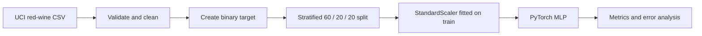

# Wine Quality Modeling Pipeline

An end-to-end PyTorch pipeline for predicting whether a red wine has a quality score of at least 6 from its physicochemical measurements. The project covers ingestion, validation, data preparation, model training, evaluation, and error analysis on the UCI Wine Quality dataset.

## Overview

The raw UCI CSV is validated and cleaned before the target is created. Data is split with stratification, and the feature scaler is fitted on training rows only. A compact tabular multilayer perceptron is then trained with class-weighted binary cross-entropy and early stopping. Each run stores the preprocessing parameters, model checkpoint, metrics, plots, and row-level test predictions.

## Pipeline



### Data preparation

- Parses the semicolon-delimited UCI file and checks the expected numeric schema.
- Replaces non-finite values, removes incomplete rows, and drops duplicates.
- Creates `good_quality` from `quality >= 6`; the original score is kept for analysis but excluded from model inputs.
- Uses deterministic stratified partitions to preserve the target distribution.
- Fits `StandardScaler` on the training partition and applies it unchanged to validation and test data.

### Model and training

`src/model.py` defines a feed-forward `TabularMLP` with 11 inputs, hidden layers of 64 and 32 units, ReLU activations, dropout, and one output logit. Training uses Adam, `BCEWithLogitsLoss`, a positive-class weight derived from the training data, and validation-loss early stopping. The best validation checkpoint is restored before test evaluation.

## Technology

| Component | Use |
| --- | --- |
| Python | Project runtime |
| pandas and NumPy | Tabular data loading, cleaning, and numerical operations |
| scikit-learn | Stratified splitting, standardization, and evaluation metrics |
| PyTorch | Model definition, tensor datasets, optimization, and training |
| Matplotlib | Learning curves, ROC curve, and confusion matrix |
| pytest | Unit and training smoke tests |
| GitHub Actions | Automated test execution |

## Evaluation

The test report includes accuracy, precision, recall, F1, balanced accuracy, Matthews correlation coefficient, ROC-AUC, and average precision. `test_predictions.csv` contains predicted probabilities, hard predictions, the original test rows, and a correctness flag for reviewing false positives and false negatives.

## Quick start

```bash
git clone https://github.com/amir-sbg/wine-quality-pytorch-pipeline.git
cd wine-quality-pytorch-pipeline

python -m venv .venv
source .venv/bin/activate       # Windows: .venv\Scripts\activate
python -m pip install -r requirements.txt
python -m pytest -q
```

Run the pipeline:

```bash
python -m src.pipeline
```

Training settings can be changed from the command line:

```bash
python -m src.pipeline \
  --epochs 120 \
  --batch-size 64 \
  --learning-rate 0.001 \
  --weight-decay 0.0001 \
  --patience 15 \
  --quality-threshold 6 \
  --seed 42 \
  --device auto
```

The first run downloads the dataset to `data/raw/`. Model artifacts and reports are written to `artifacts/` and `reports/`.

## Outputs

```text
artifacts/
├── model.pt
├── scaler.json
├── training_history.csv
└── run_config.json

reports/
├── data_quality.json
├── metrics.json
├── run_summary.json
├── test_predictions.csv
├── confusion_matrix.png
├── learning_curve.png
└── roc_curve.png
```

## Project structure

```text
.
├── .github/workflows/ci.yml
├── src/
│   ├── data.py          # download, validation, cleaning, profiling
│   ├── model.py         # PyTorch tabular MLP
│   ├── train.py         # loaders, weighted loss, early stopping
│   ├── evaluate.py      # metrics, plots, and predictions
│   └── pipeline.py      # command-line orchestration
├── tests/
│   └── test_pipeline.py
├── Makefile
├── pyproject.toml
├── requirements.txt
└── README.md
```

The dataset is small and the quality threshold is a modeling decision. The saved artifacts and test predictions make those choices visible and provide a basis for comparing alternative thresholds, models, or calibration methods.
