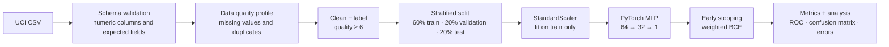

# Wine Quality Modeling Pipeline

**Recommended repository name:** `wine-quality-pytorch-pipeline`

**About:** A reproducible, end-to-end data science pipeline that takes the public UCI Wine Quality dataset from raw CSV ingestion through preprocessing, PyTorch model training, evaluation, and error analysis.

## Overview

This repository is a practical example of how I structure a small machine-learning project from zero to a usable result. It starts with a public dataset, validates the incoming schema, profiles data quality, creates a documented target, splits data without leakage, fits preprocessing on the training set only, trains a PyTorch multilayer perceptron, and saves evaluation artifacts that make the result inspectable.

The target is a binary classification task: a red wine is labeled `good_quality` when its original UCI quality score is at least 6. The original `quality` column is retained for analysis but is excluded from the feature matrix, so the model only receives the 11 physicochemical measurements available before the label.

## Technology stack

| Area | Packages and tools | Purpose |
| --- | --- | --- |
| Language and runtime | Python 3.11 | Reproducible project environment |
| Data handling | `pandas`, `NumPy` | CSV ingestion, cleaning, numerical arrays, and summaries |
| Preprocessing and splitting | `scikit-learn` | `StandardScaler` and stratified train/validation/test splits |
| Model development | `PyTorch` | Tensor datasets, data loaders, MLP layers, weighted loss, and optimization |
| Evaluation | `scikit-learn` | Classification metrics, ROC/AUC, average precision, and confusion matrices |
| Reporting | `Matplotlib` | Learning curves, ROC curves, and confusion-matrix figures |
| Quality checks | `pytest` and GitHub Actions | Smoke tests, schema tests, and automated CI |

## Data-processing methods

The preprocessing pipeline follows a deliberate order:

1. Download the raw semicolon-delimited CSV and validate the expected feature/target schema.
2. Replace infinite values, remove incomplete rows, and drop duplicate records.
3. Derive the binary `good_quality` label from the original quality score.
4. Split the labeled data with stratification before fitting any transformation.
5. Fit `StandardScaler` on the training partition only, then apply the learned means and scales to validation and test rows.
6. Save a data-quality summary, split sizes, and the fitted preprocessing parameters for inspection.

This ordering prevents test-set information from influencing the feature scaling step and makes the transformation reproducible at inference time.

## Modeling and analysis methods

The model is a feed-forward multilayer perceptron implemented directly with `torch.nn`: 11 standardized inputs, two hidden layers, ReLU activations, dropout, and one output logit. Training uses Adam with `BCEWithLogitsLoss` and a positive-class weight calculated from the training partition. Validation-loss early stopping restores the best observed model state.

The evaluation layer reports accuracy, precision, recall, F1, balanced accuracy, Matthews correlation coefficient, ROC-AUC, and average precision. It also saves row-level predictions so false positives and false negatives can be reviewed instead of relying on a single aggregate score.

## Pipeline



## Dataset

The project uses the public [UCI Wine Quality dataset](https://archive.ics.uci.edu/dataset/186/wine+quality), specifically the red-wine CSV. It contains 1,599 rows, 11 numeric input features, and an integer quality score.

The pipeline records the following decisions in code:

- semicolon-delimited CSV parsing
- replacement of infinite values and removal of incomplete rows
- duplicate removal before splitting
- binary target creation with `quality >= 6`
- stratified 60/20/20 train, validation, and test partitions
- standardization fitted only on the training partition
- class-weighted binary cross-entropy for the PyTorch model

The dataset is small enough for a fast local run while still exposing the decisions that matter in larger production pipelines: schema drift, class balance, data leakage, reproducibility, and error inspection.

## Model

`src/model.py` implements a compact `TabularMLP` with:

- 11 standardized input features
- fully connected layers of 64 and 32 units
- ReLU activations and dropout
- one output logit for binary classification
- `BCEWithLogitsLoss` with a training-set-derived positive-class weight
- Adam optimization and validation-loss early stopping

The model is intentionally simple. The focus of this repository is the full workflow around model development and analysis rather than claiming state-of-the-art performance on a small dataset.

## Quick start

```bash
git clone https://github.com/amir-sbg/wine-quality-pytorch-pipeline.git
cd wine-quality-pytorch-pipeline

python -m venv .venv
source .venv/bin/activate       # Windows: .venv\Scripts\activate
python -m pip install -r requirements.txt
python -m pytest -q
```

Run the complete pipeline:

```bash
python -m src.pipeline
```

Useful options:

```bash
python -m src.pipeline \
  --epochs 120 \
  --batch-size 64 \
  --quality-threshold 6 \
  --seed 42 \
  --device auto
```

The first run downloads the dataset to `data/raw/`. Generated files are written to `artifacts/` and `reports/`.

## Outputs

The run creates:

```text
artifacts/
├── model.pt              # model weights and training metadata
├── scaler.json           # train-fitted means and scales
├── training_history.csv
└── run_config.json

reports/
├── data_quality.json
├── metrics.json
├── run_summary.json
├── test_predictions.csv
├── confusion_matrix.png
├── learning_curve.png
└── roc_curve.png
```

`test_predictions.csv` is the main error-analysis entry point. It contains the original test rows, predicted probabilities, hard predictions, and a `correct` flag so false positives and false negatives can be inspected directly.

## Reproducibility and engineering choices

- `--seed` controls Python, NumPy, PyTorch, and CUDA random seeds.
- The scaler is fitted after the split and only on training rows.
- Stratification preserves the target balance across partitions.
- The best validation checkpoint is restored after early stopping.
- The saved checkpoint includes feature names, thresholds, and training metadata.
- Tests cover schema validation, target creation, model output shape, and a short training smoke test.
- A GitHub Actions workflow runs the test suite on pushes and pull requests.

## Project structure

```text
.
├── .github/workflows/ci.yml
├── src/
│   ├── data.py          # download, validation, cleaning, profiling
│   ├── model.py         # PyTorch tabular MLP
│   ├── train.py         # loaders, weighted loss, early stopping
│   ├── evaluate.py      # metrics, plots, predictions, error analysis
│   └── pipeline.py      # command-line orchestration
├── tests/
│   └── test_pipeline.py
├── Makefile
├── pyproject.toml
├── requirements.txt
└── README.md
```

## Limitations and next steps

This is a portfolio-scale example, not a production or scientific benchmark. The dataset is small, the label threshold is a modeling choice, and the features do not represent every factor that affects wine quality. A stronger follow-up would compare calibrated models, add cross-validation, track experiments, and package the trained model behind a typed inference API.
